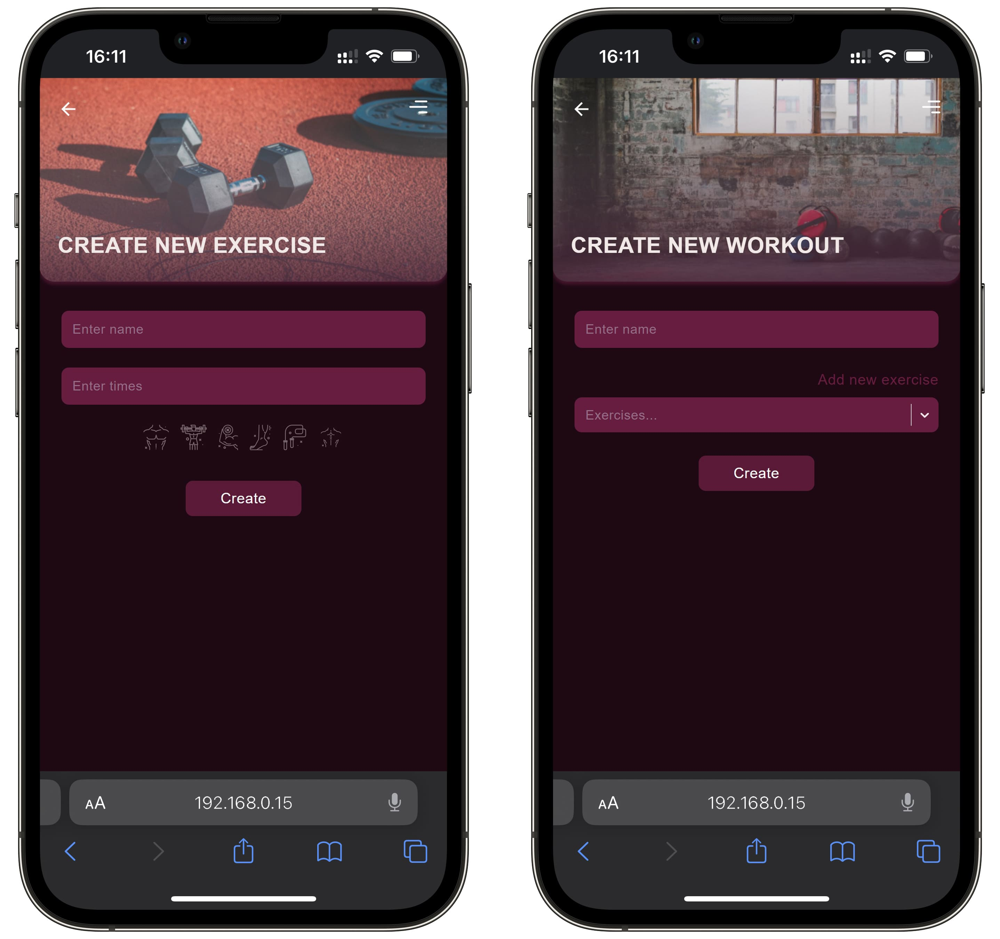
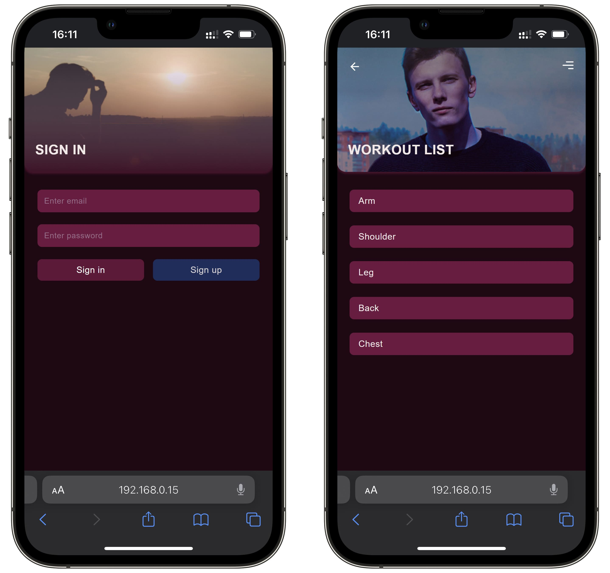

# Workout

«Workout» —  is a website for tracking progress in training and your body

### Technology stack:
- React
- React Query (TanStack Query)
- Redux Toolkit
- Axios
- React-Select

## Index and Profile:

## Workout and Exercise:

## Create Exercise and Workout:

## Auth and Workout List:

